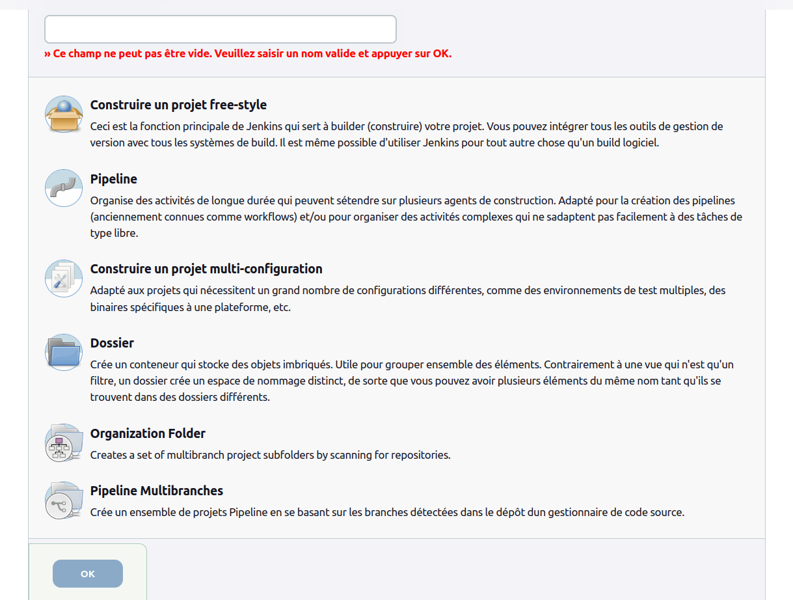

# Exercice 1 - Installer et configurer Jenkins

## Objectifs

Cet exercice a pour objectifs :
* d'avoir un Jenkins installé et configurer
* de découvrir l'interface et les concepts de Jenkins

## Pré-requis

* Avoir sur sa machine git, docker et docker-compose installé
* Créer un fork dans votre compte github du dépôt : https://github.com/vanessakovalsky/python-api-handle-it.git 
* Cloner ce dépôt

## Installation de jenkins

* A partir du dossier cloné, se mettre dans le dossier docker et lancer la commande :
```
docker-compose up -d --build
```
* Cela permet d'avoir une image de jenkins qui contient Docker (qui nous sera utile pour les acitons d'intégration et de déploiement continue) et de lancer un conteneur
* Une fois le conteneur lancé (vérifier qu'il est au statut up), se rendre à l'url : http://localhost:8080 pour accéder à l'interface de Jenkins

## Configurer le jenkins

* La première chose que vous demande Jenkins est le mot de passe pour dévérouiller jenkins

* Pour récupérer ce mot de passe afficher les logs de votre conteneur, il doit se trouver dedans :

* Ensuite Jenkins vous propose d'installer les plugins suggérés ou de choisir les plugins à installé, laissez l'option par défaut d'installer les plugins suggérés :

* Puis Jenkins vous demande de créer un compte administrateur, remplir le formulaire et cliquer sur  `Save and continue`

* Votre Jenkins est maintenant prêt à être utilisé

## Découverte de Jenkins

* Lorsque vous arrivez sur le tableau de bord de Jenkins, vous pouvez créer un nouvel item
 
* Il s'agit ici des éléments suivants :
    * Projet free-style : permet de construire des jobs jenkins avec l'ancienne façon de faire de jenkins, avec des tâches les unes après les autres
    * Pipeline : permet de construire des jobs jenkins avec des tâches en parallèle, c'est aujourd'hui la méthode recommandé d'utilisation de Jenkins
    * Projet multi-configuration : permet de gérer les gros projets avec de nombreux fichiers de configuration nécessaires
    * Dossier : permet de classer ces projets dans des dossiers
    * Organization folder : permet de créer des sous dossier basé sur les branches d'un dépot de code
    * Pipeline multibranche : permet de gérer plusieurs branche d'un dépôt de code au sein d'un même pipeline
* Créer un projet de type Pipeline en lui donnant un nom, en sélectionnant Pipeline et en cliquant sur OK
* Dans la rubrique Source code management, choisir Git et rentrer l'URL du projet : https://github.com/vanessakovalsky/python-api-handle-it.git (mettre l'URL de votre propre dépôt)
* Cliquer sur Sauver
* Vous arrivez sur la page du Job
* Vous pouvez executer le job en cliquant sur Lancer un build
* Le job se lance, cliquez dessus pour avoir des informations
* En allant dans Console Output, que voyez vous ? 


## Configurer Github pour déclencher un build à chaque commit
* Vous avez besoin d'un token d'API de Jenkins pour configurer le webhook dans github
* Sur jenkins, cliquer sur votre nom en haut à droite
* Puis sur Configure dans le menu
* Dans la section API Token, cliquer sur Add new token, et copier le token généré
* Aller sur votre projet Github
* Dans les paramètres, choisir Webhook
* Cliquer sur Add webhook :
* * Dans payload URL, entrer l'adresse de Jenkins sous la forme http://[login]:[APITOKEN]@[URLduJenkins.com:8080]/github-webhook
* Enregistrer
* Côté Jenkins, aller dans le job
* Dans la rubrique Build Triggers, cochez la case : GitHub hook trigger for GITScm polling 

-> Votre job est configuré pour être lancé à chaque push sur la branche master dans votre dépôt Github